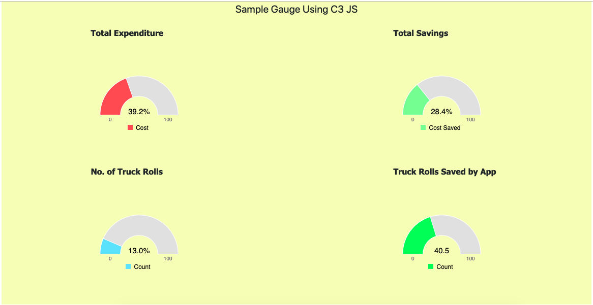

# Sample-Gauge-Chart
Sample Gauge Chart using C3 JS

Instruction to run :

1) Clone the repo
2) Navigate to cloned folder
3) Double click on the index.html file

Then you should see the below image in browser : 

